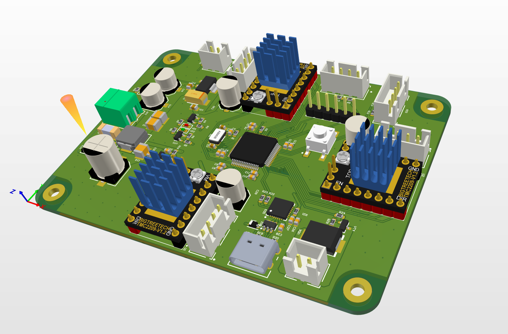

# Coffee Printer PCB Project

## Project Status
This project is currently **under development**. Please note that some features might be incomplete or may undergo changes in the near future.

## Overview
The Coffee Printer PCB project aims to provide a foundation for controlling the Coffee Art Printer. The Art Printer's printhead consists of a needle that extracts foam at programmatically defined locations, creating beautiful pictures on the foam surface.

The 3D view of the PCB is illustrated above.

## Implementation
The coffee printer relies on three movable axes: a rotating platform, a vector along which the printhead moves, and vertical needle movement. An Android application controls these components over USB, including predefined pictures and basic movement commands.

The system is operated by stepper motors and an STM32L431RCT6 microcontroller. Two slot photocoupler end-stop switches and a foam surface sensor are integrated. The stepper motors are managed using TMC2209 drivers.

A custom StepperMotor management library has been created for the project.

## PCB Design
The printed circuit board (PCB) is designed to cater to the specific needs of the Coffee Printer. The design facilitates the various functionalities of the Coffee Printer like controlling the three axes, integrating the sensors, and connecting to the Android application over USB.

## Contact
If you have any questions or suggestions, feel free to email feodosiy2404@gmail.com

# gffkwfb
